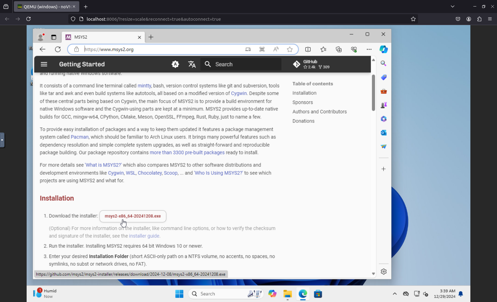
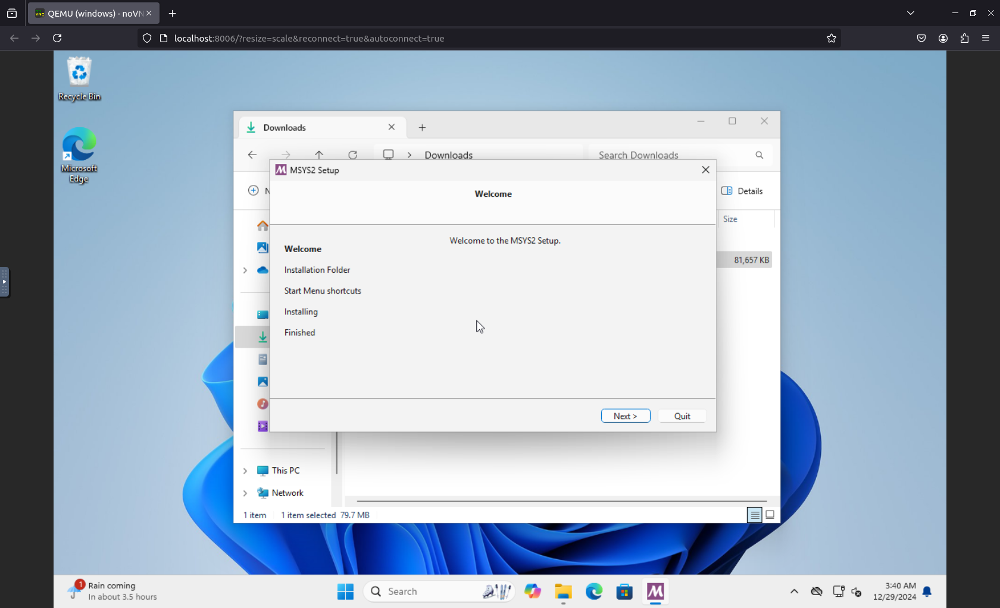
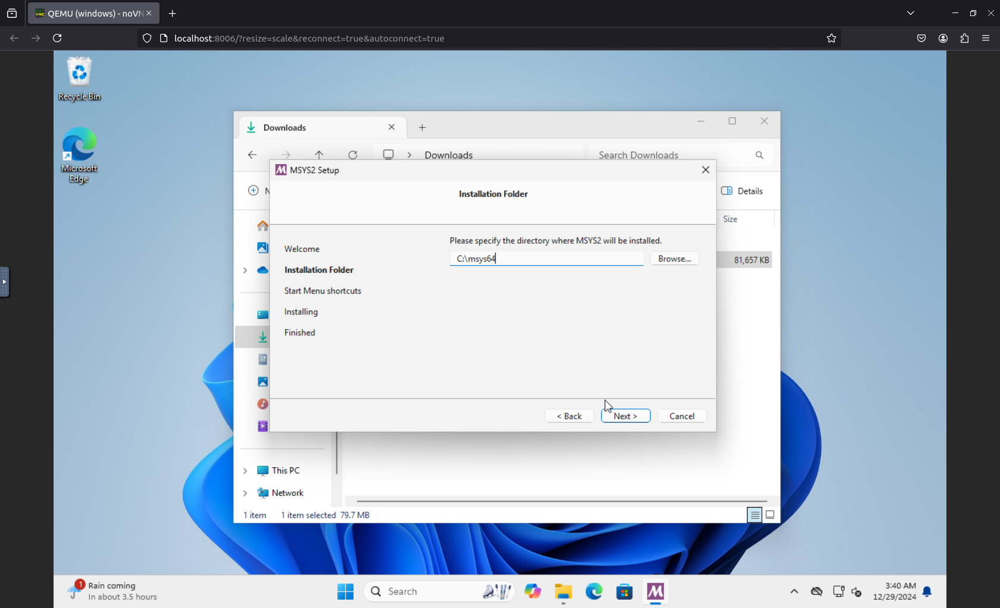
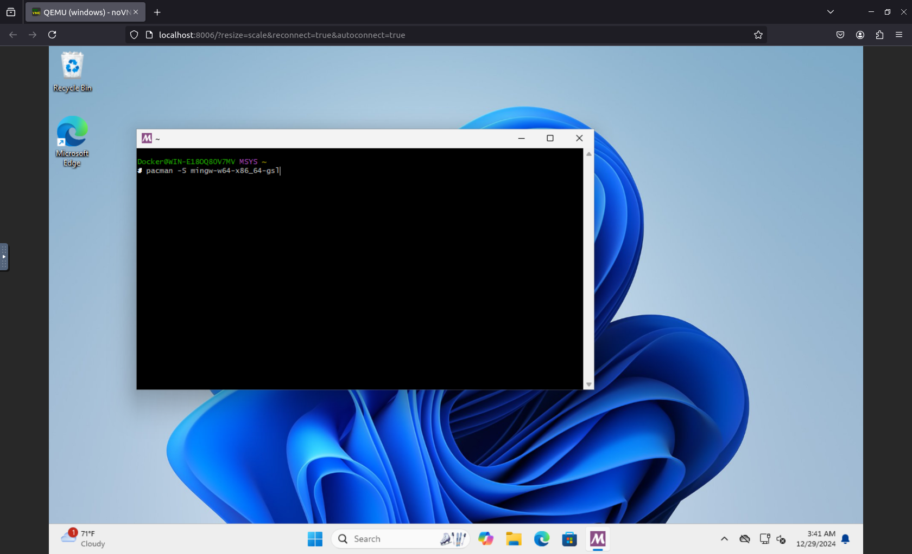
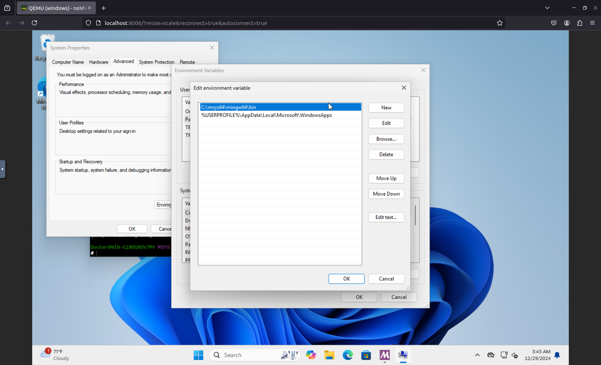

# Install MINGW using Msys2 with sfml (FULL)
(preface: uninstall your currenct gcc compiler)

### 1. follow and install this link https://msys2.github.io/
<div style="display:flex;">


</div>


### 2. click on the MSYS2 UCRT64 in the Start menu 
<div style="display:flex;">

</div>

### 3. run the following command in order
```
pacman -S mingw-w64-x86_64-gsl
```
```
pacman -S mingw-w64-x86_64-cmake
```
```
pacman -S mingw-w64-x86_64-gcc
```
```
pacman -S mingw-w64-x86_64-sfml
```
```
pacman -S mingw-w64-x86_64-make
```
<div style="display:flex;">

</div>

### then add this to your environment variables
```
C:\msys64\mingw64\bin
```
<div style="display:flex;">

</div>

### Restart your computer, and your done!

